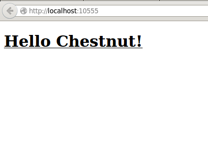

# Getting Started

The only requirement for using Chestnut is that
[Leiningen](http://leiningen.org/), version 2 or greater, is
installed. Leiningen will take care of downloading Chestnut, Clojure,
and other dependencies, so it's literally all you need.

Leiningen and Clojure depend on Java, but chances are this will
already be available on your system. You will need at least version
1.7. Oracle Java 1.8 is recommended.

## Creating the Application

With Leiningen installed, open a terminal and type

``` sh
lein new chestnut <name>
```

This will create a directory with the name of your project, containing
an application skeleton that you can fill in. This directory also
contains a file named `README.md`. It has instructions on how to get
started that are specific to the version of Chestnut you are
using. Make sure to look at it!

## Quickstart for the Impatient

If you want to see your application running as soon as possible, try this.

In a terminal, start the Clojure REPL.

``` sh
lein repl
```

Once you see the Clojure REPL prompt, `user=>`, type

```
(run)
(browser-repl)
```

`(run)` will initiate the Clojurescript compilation, start a web
server, and start the
[Figwheel](https://github.com/bhauman/lein-figwheel) server to enable
instant code reloading.

`(browser-repl)` will change your Clojure REPL into a Clojurescript
REPL. It needs a connection with a browser to be able to evaluate
Clojurescript, so at this point it's waiting for a browser to connect
to it.

Once it seems everything has finished starting up and compiling, point
your browser at [http://localhost:10555](http://localhost:10555). You
should be seeing something like this:


